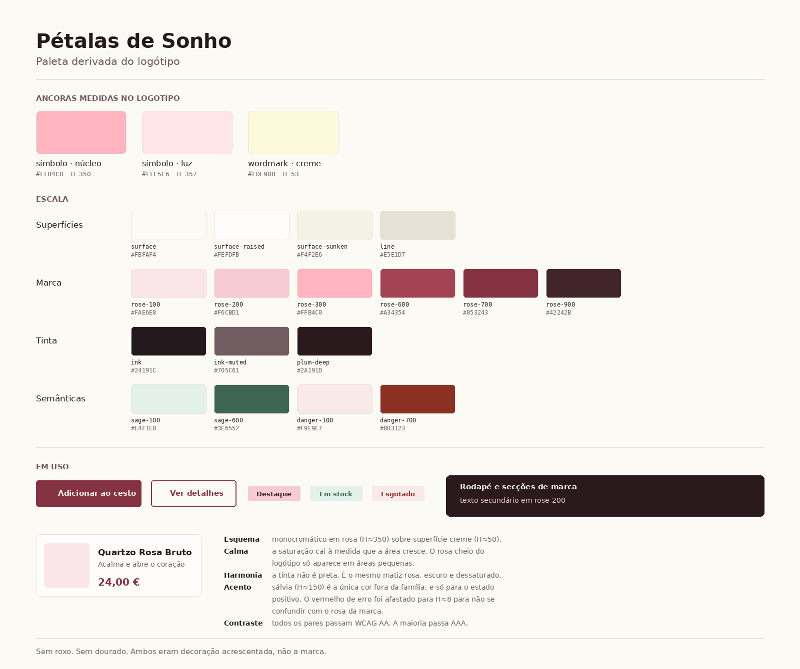

# Paleta da marca - Pétalas de Sonho



---

## De onde vêm estas cores

Não foram escolhidas por gosto. Foram **medidas no próprio logótipo**, extraindo as
imagens embutidas em `public/images/logo-icon.svg` e contando os pixels dominantes.

| Elemento | Cor medida | Matiz | Saturação | Luminosidade |
|---|---|---|---|---|
| Símbolo, núcleo do cristal | `#FFB4C0` | 350° | 100% | 85% |
| Símbolo, faces iluminadas | `#FFE5E6` | 357° | 100% | 95% |
| Wordmark "pétalas de sonho" | `#FDF9DB` | 53° | 90% | 93% |

**A marca é quartzo rosa e creme.** O símbolo é um agregado de cristais de quartzo
rosa com duas pétalas, e o wordmark é um script arredondado em creme.

O roxo `#4a1e5c` (130 ocorrências no código) e o dourado `#d4af37` **não existem no
logótipo**. Foram acrescentados por cima e contradizem a própria marca. É por isso
que o site parecia genérico: a paleta pertencia a outra loja qualquer.

---

## Raciocínio de cor

O pedido foi harmonia e calma, mantendo as cores da marca. Isso resolve-se com quatro
decisões, não com uma escolha de tom.

### 1. Esquema monocromático, não complementar

Tudo vive na família 343° a 357°, o matiz do quartzo rosa. Esquemas complementares
criam tensão, que é o oposto de calma. Um esquema monocromático mantém o olho numa
só zona do círculo cromático.

O creme do wordmark, a 53°, torna-se a superfície. Rosa e creme são ambos quentes,
por isso não há o choque de temperatura que acontece quando se mistura um cinzento
frio com um tom quente.

### 2. A saturação cai à medida que a área cresce

Este é o ponto que faz a diferença entre calmo e berrante.

O rosa do logótipo tem **100% de saturação**. Lê-se suave porque é claro, não porque
seja pouco saturado. Espalhar esse rosa por superfícies grandes seria agressivo.

Por isso:

| Área | Saturação | Onde |
|---|---|---|
| Grande (fundos de página) | 38% a 47% | `surface`, `surface-sunken` |
| Média (cartões, faixas) | 25% a 30% | `plum-deep`, `rose-900` |
| Pequena (botões, etiquetas) | 42% a 70% | `rose-700`, `rose-200` |
| Mínima (acentos pontuais) | 100% | `rose-300`, o rosa puro do logótipo |

**O rosa cheio da marca só aparece em áreas pequenas.** É assim que se mantém a
identidade sem cansar.

### 3. A tinta não é preta

Preto puro sobre creme é duro e quebra a harmonia. O texto usa `#24191C`, que é o
**mesmo matiz rosa a 344°**, escurecido para 12% de luminosidade e dessaturado para
18%. Lê-se como quase-preto, mas pertence à família.

É uma diferença que ninguém nota conscientemente e que toda a gente sente.

### 4. As cores semânticas foram afastadas de propósito

Um problema real deste esquema: **vermelho de erro e rosa da marca são vizinhos no
círculo cromático.** Um alerta vermelho ao lado de um botão rosa confunde-se.

Solução: o vermelho de erro foi empurrado para 8°, mais alaranjado e muito mais
escuro (34% de luminosidade contra os 85% do rosa da marca). Fica inequívoco.

O verde de sucesso usa sálvia a 150°, que é split-complementar do rosa. É a **única
cor fora da família**, e só aparece em estado positivo. Sálvia, e não verde vivo,
para não quebrar a calma.

---

## Tokens

```css
:root {
  /* Superfícies, herdadas do creme do wordmark */
  --surface:          #FBFAF4;   /* fundo de página */
  --surface-raised:   #FEFDFB;   /* cartões e painéis */
  --surface-sunken:   #F4F2E6;   /* secções alternadas */
  --line:             #E5E1D7;   /* bordas e divisores */

  /* Marca, herdada do símbolo */
  --rose-100:         #FAE6E8;   /* fundos de etiqueta */
  --rose-200:         #F6CBD1;   /* etiquetas, texto sobre escuro */
  --rose-300:         #FFB4C0;   /* o rosa do logótipo, só em áreas pequenas */
  --rose-600:         #A34354;   /* estados hover */
  --rose-700:         #853243;   /* ação primária, links */
  --rose-900:         #42242B;   /* texto sobre rosa claro */

  /* Tinta, mesma família de matiz */
  --ink:              #24191C;   /* texto principal */
  --ink-muted:        #705C61;   /* texto secundário */
  --plum-deep:        #2A191D;   /* header, footer, secções de marca */

  /* Semânticas */
  --sage-100:         #E4F1EB;
  --sage-600:         #3E6552;   /* sucesso, em stock */
  --danger-100:       #F9E9E7;
  --danger-700:       #8B3123;   /* erro, esgotado */
}
```

---

## Contrastes verificados

Todos calculados segundo a WCAG 2.1. **Nenhum par falha AA.**

| Par | Rácio | Nível |
|---|---|---|
| `ink` sobre `surface` | 16.32:1 | AAA |
| `ink` sobre `surface-raised` | 16.78:1 | AAA |
| `ink` sobre `surface-sunken` | 15.18:1 | AAA |
| `ink-muted` sobre `surface` | 5.92:1 | AA |
| `rose-700` sobre `surface` (links) | 7.92:1 | AAA |
| `surface` sobre `rose-700` (botão primário) | 7.92:1 | AAA |
| `rose-600` sobre `surface` | 5.76:1 | AA |
| `surface` sobre `plum-deep` (footer) | 16.00:1 | AAA |
| `rose-200` sobre `plum-deep` | 11.46:1 | AAA |
| `rose-300` sobre `plum-deep` | 9.99:1 | AAA |
| `ink` sobre `rose-100` | 14.26:1 | AAA |
| `rose-900` sobre `rose-200` (etiqueta) | 9.47:1 | AAA |
| `sage-600` sobre `surface` | 6.30:1 | AA |
| `sage-600` sobre `sage-100` | 5.67:1 | AA |
| `danger-700` sobre `surface` | 7.84:1 | AAA |
| `danger-700` sobre `danger-100` | 6.96:1 | AA |

Para comparação, o que existe hoje: o badge "Destaque", branco sobre dourado, está
a **2.10:1**. Falha AA por larga margem.

---

## Regras de uso

1. **Um acento.** `rose-700` é a cor de toda a interação: botões primários, links,
   estados ativos, foco. Nada de uma cor para botões e outra para links.
2. **Zero glow.** Nenhuma sombra colorida. As sombras são `ink` a opacidade muito
   baixa, sempre deslocadas para baixo, com uma só direção de luz.
3. **Zero gradiente de marca.** Nem diagonal, nem roxo, nem nada. Se for preciso
   profundidade, usa-se `surface-sunken` ou grão subtil.
4. **O produto manda na cor.** As fotografias de cristais trazem verde, roxo, azul e
   laranja. A interface é calma precisamente para que isso não compita. Nenhum
   overlay colorido por cima de fotografia de peça.
5. **O rosa cheio é raro.** `rose-300` aparece em etiquetas, ícones pequenos e
   detalhes. Nunca num fundo de secção.

---

## O que falta decidir

- **Tema escuro.** A paleta está construída para tema claro, que é o que combina com
  um wordmark creme e com o pedido de calma. Um tema escuro derivado de `plum-deep`
  é possível e fica para depois de a v1.0.0 estar de pé.
- **Tipografia.** O wordmark é um script arredondado. O par tipográfico da interface
  tem de ser escolhido contra ele, e isso faz-se quando o logótipo for redesenhado
  em vetor (F1 do roteiro).
